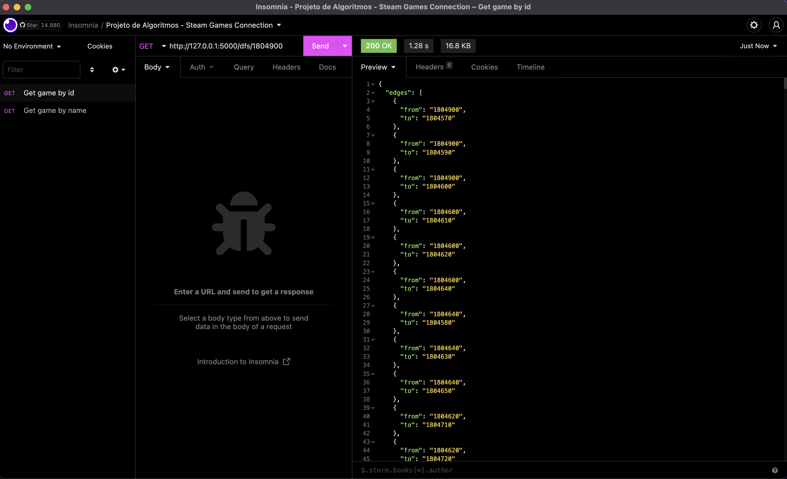
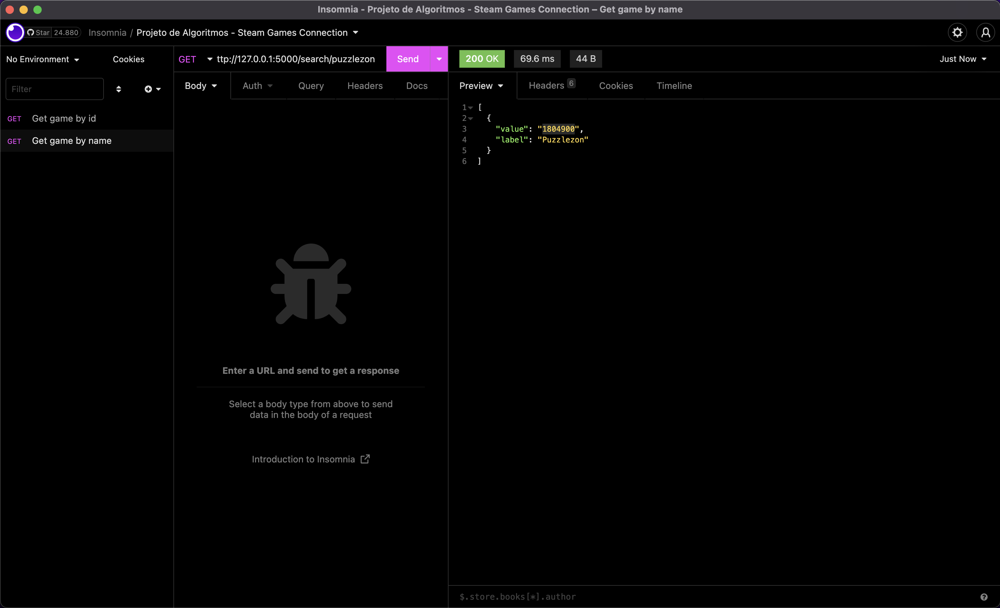
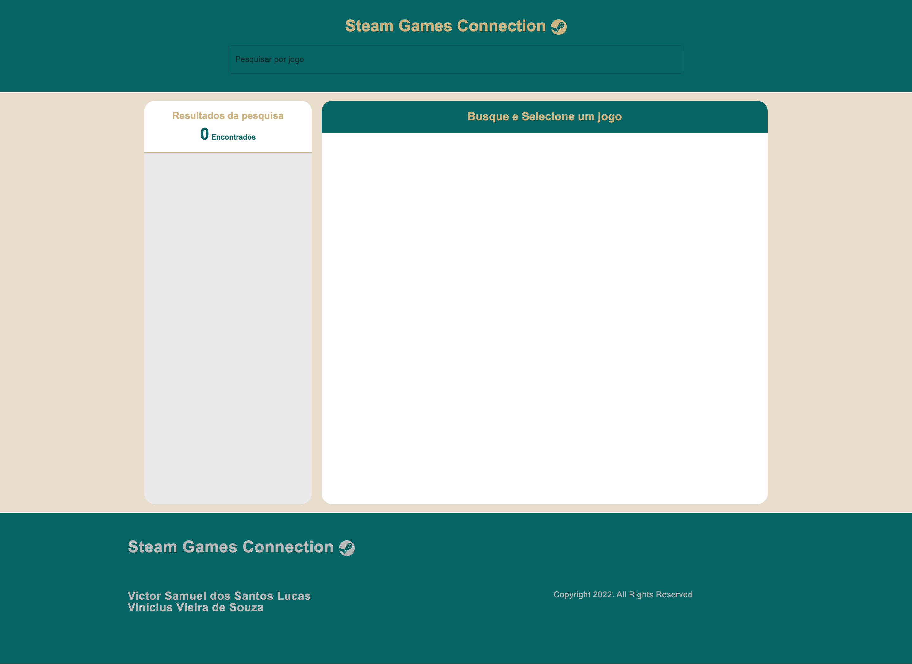
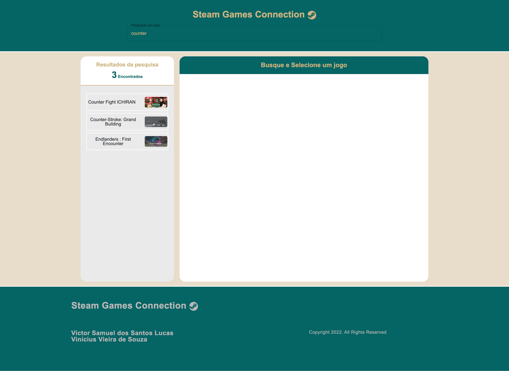
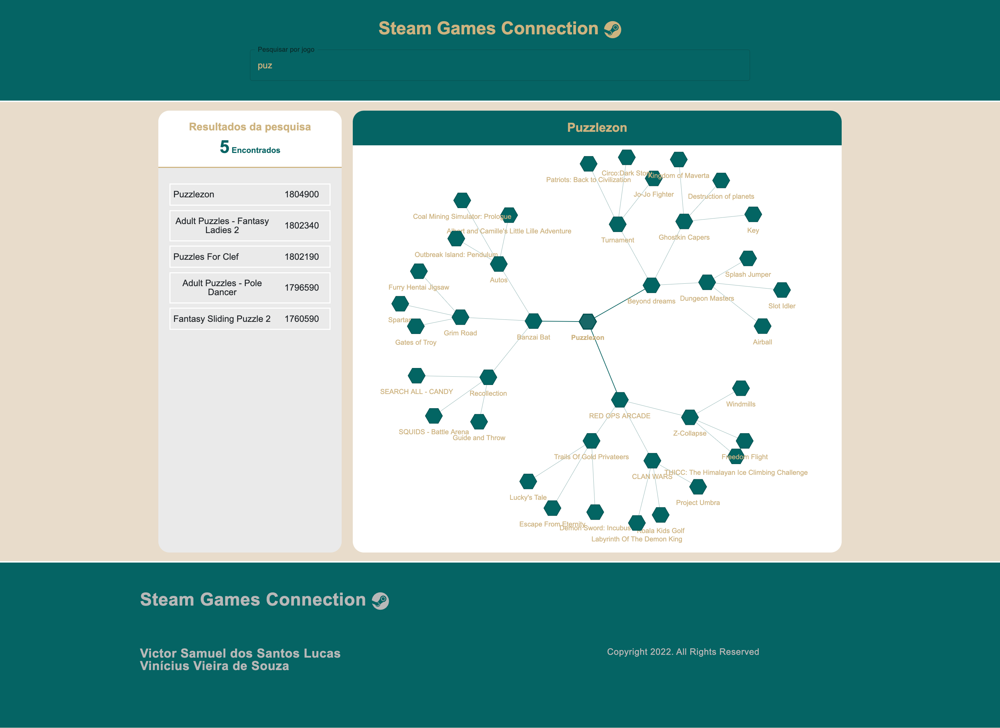

**Grafos1_SteamGamesConnection** 
# SteamGamesConnection

**Número da Lista**: Dupla 4<br>
**Conteúdo da Disciplina**: Grafos 1<br>

## Alunos
|Matrícula | Aluno |
| -- | -- |
| 18/0028685  |  Victor Samuel dos Santos Lucas |
| 17/0115500  |  Vinícius Vieira de Souza |

## Sobre 
Este projeto tem como objetivo servir como base para implementação de algoritmos relacionados a estudos voltados ao conteúdo de Grafos 1.

O projeto em questão se trata de uma aplicação que por meio de uma busca por profundidade iterativa (DFS iterativa) cria um grafo de jogos similares a um jogo específico. Essa busca é  feita através de uma pesquisa de jogos na base de dados da plataforma de jogos <a href="https://store.steampowered.com/">Steam</a>. 

## Screenshots
### - API
#### Busca de jogo por ID


#### Busca de jogo por NOME


### - FRONTEND
#### HOMEPAGE


#### Busca por jogo


#### Grafo do jogo


## Instalação 
**Linguagem**: Python (Backend) / Javascript (Frontend)<br>
**Framework**: Flask (Backend) / React (Frontend)<br>

### Requisitos:
- Python: Versão 3+
- Node: Versão 16+
- Npm: Versão 6+

## Uso 

### Passo 0:
No diretório raiz do projeto instale as dependências necessárias para o backend com: 
```sh
pip3 install -r backend/src/requirements.txt
```
### Passo 1:
No diretório raiz do projeto, execute:
```sh
export FLASK_APP=backend/src/main.py
```
### Passo 2:
Coloque o backend em execução com:
```sh
flask run
```
### Passo 3: 
Em outro terminal, abra o projeto no diretório /frontend e instale o pacote de dependências do frontend com:
```sh
npm install
```
### Passo 4:
Coloque o frontend em execução com:
```sh
npm start
```
### Passo 5:
Caso não abra automáticamente, para acessar a aplicação abra seu navegador no seguinte endereço: http://localhost:3000

## OBS:
- O backend e frontend fazem uso respectivamente das portas:  http://localhost:5000 e http://localhost:3000, dessa forma certifique-se de que estejam livres para rodar a aplicação.
\

## Vídeo de apresentação 

- Acesse pelo [Sharepoint](https://unbbr.sharepoint.com/sites/PA-Gravaes/Documentos%20Compartilhados/General/Recordings/Grava%C3%A7%C3%A3o%20PA_GRAFOS01-20221120_153037-Grava%C3%A7%C3%A3o%20de%20Reuni%C3%A3o.mp4?web=1)

- Clique [aqui](/public/assets/video_01.mp4) para baixar o vídeo.

- Caso nenhuma das opções esteja disponível, o vídeo encontrasse dentro do repositório no caminho "public/assets/video_01.mp4".

