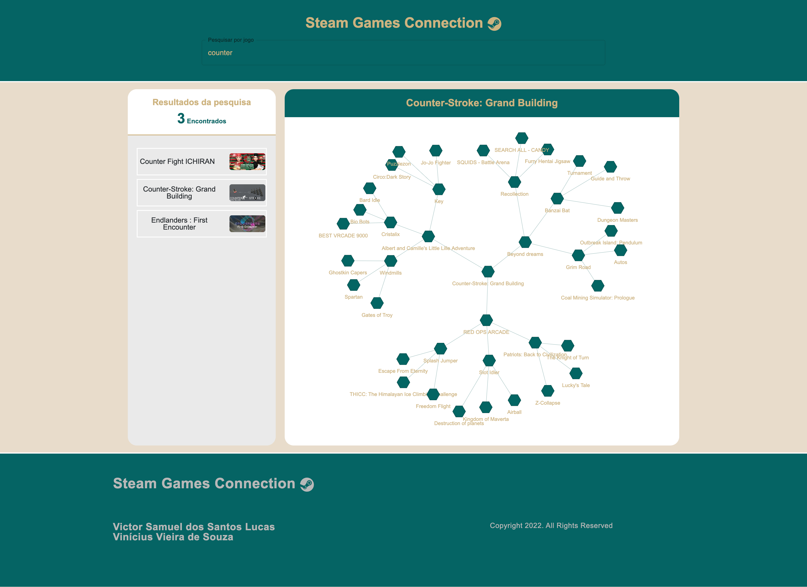

**Grafos1_SteamGamesConnection** 
# SteamGamesConnection

**Número da Lista**: X 
**Conteúdo da Disciplina**: Grafos 1 

## Alunos
|Matrícula | Aluno |
| -- | -- |
| 18/0028685  |  Victor Samuel dos Santos Lucas |
| xx/xxxxxx  |  xxxx xxxx xxxxx |

## Sobre 
Descreva os objetivos do seu projeto e como ele funciona. 

## Screenshots
### - API
#### Busca de jogo por ID

#### Busca de jogo por NOME

### - FRONTEND
#### HOMEPAGE

#### Busca por jogo

#### Grafo do jogo

## Instalação 
**Linguagem**: xxxxxx 
**Framework**: (caso exista) 
Descreva os pré-requisitos para rodar o seu projeto e os comandos necessários.

## Uso 
Explique como usar seu projeto caso haja algum passo a passo após o comando de execução.

## Outros 
Quaisquer outras informações sobre seu projeto podem ser descritas abaixo.
